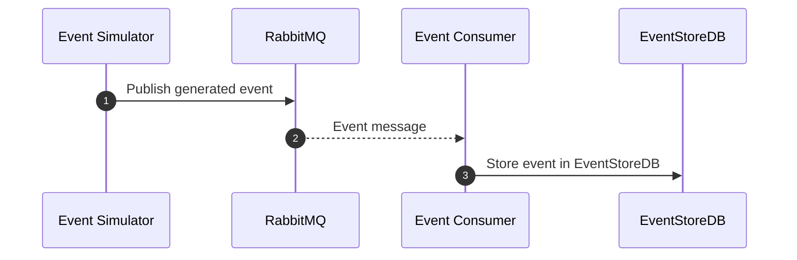
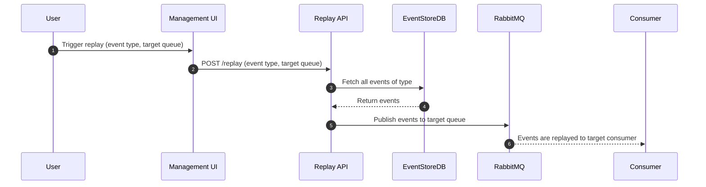

Here's a README document for your prototype system that acts as a RabbitMQ event store with replay functionality, including mermaid sequence diagrams showing the flow in the system.

---

# Event Store Demo with RabbitMQ and EventStoreDB

## Overview

This project demonstrates an event-sourced system using RabbitMQ as the message broker, EventStoreDB as the historical store, and a replay mechanism to reproduce past events. The system consists of several components:

- **Event Simulator**: Generates synthetic e-commerce events and publishes them to RabbitMQ.
- **Event Consumer**: Consumes events from RabbitMQ and stores them in EventStoreDB.
- **Replay API**: Provides a FastAPI-based REST API to replay historical events from EventStoreDB back to RabbitMQ.
- **Management UI**: A web-based user interface built using Flask to trigger event replays.

## Components and Flow

1. **Event Simulator** (`event_simulator.py`):

   - Generates random e-commerce events such as user registration, product views, and order placements.
   - Publishes these events to specific RabbitMQ topics (`ecommerce-exchange`).

2. **Event Consumer** (`consumer.py`):

   - Listens to events from RabbitMQ.
   - Writes consumed events to EventStoreDB for historical storage.

3. **Replay API** (`replay_api.py`):

   - Exposes an API endpoint to trigger event replays.
   - Fetches all historical events of a specified type from EventStoreDB and replays them to a RabbitMQ queue.

4. **Management UI** (`replay_management_ui.py`):
   - Provides a web interface to trigger replays using the Replay API.
   - Users can input an event type and target queue to initiate a replay.

## Sequence Diagrams

Below are sequence diagrams representing the flow of events in the system:

### Event Ingestion Flow



1. The **Event Simulator** generates an event and publishes it to **RabbitMQ**.
2. The **Event Consumer** consumes the event message from **RabbitMQ**.
3. The **Consumer** writes the event to **EventStoreDB** for future reference.

### Event Replay Flow



1. The **User** triggers a replay using the **Management UI**.
2. The **UI** sends a request to the **Replay API** with the event type and target queue.
3. The **Replay API** fetches all historical events of the given type from **EventStoreDB**.
4. The **Replay API** publishes each event to the specified **RabbitMQ** queue for replay.

## Prerequisites

- Docker & Docker Compose
- Poetry for dependency management

## Setup Instructions

1. **Clone the repository**:

   ```sh
   git clone <repository-url>
   cd event-store-demo
   ```

2. **Install dependencies**:

   ```sh
   poetry install
   ```

3. **Start Services**:

   Start the required Docker services (RabbitMQ and EventStoreDB):

   ```sh
   task start_services
   ```

4. **Run the Event Simulator**:

   To start generating events, sending them to RabbitMQ, and writing them to EventStoreDB

   ```sh
   task run_all_ingress
   ```

5. **Run the Event Simulator**:

   To start up the replay API & management UI

   ```sh
   task run_all_replay
   ```

6. **Access the Management UI**:

   Open your browser and navigate to [http://localhost:5000](http://localhost:5000) to interact with the management UI.

### Monitoring the system

You can see the event streams storage in EventStoreDB management console at [http://localhost:2113][http://localhost:2113].

You can see the RabbitMQ management console at [http://localhost:15672][http://localhost:15672].

## System Overview

This system provides an end-to-end example of an event-sourced architecture:

- **Ingestion**: Events are generated and stored for long-term retention.
- **Replay**: Past events can be replayed to reconstruct state, verify behavior, or resynchronize downstream systems.
